# PMBOK Comprehensive Study Guide & Exam Solutions

This guide serves as a complete study manual, aligning the Project Management curriculum of ARP Technology and the University of Ibadan with the official PMI Project Management Body of Knowledge (PMBOK Guide, 6th and 7th Editions). It contains the core theoretical frameworks, scheduling and budgeting formulas, and the official worked solutions for the March 2026 Final Examination.

---

## Part 1: Core Project Management & PMBOK Standards

### Section 1: Project Management Fundamentals

#### Project Definition
A project is a temporary endeavor undertaken to create a unique product, service, or result. (Reference: PMBOK Guide).
* **Key Characteristics:**
  * It has a defined start and end date (temporary).
  * It produces a unique deliverable (product, service, or outcome).
  * It operates under specific objectives.
  * It uses limited resources (budget, time, staff, and equipment).
  * It terminates when objectives are met, or when it is canceled.

#### Project Management
The application of knowledge, skills, tools, and techniques to project activities to meet project requirements and objectives.

#### Projects, Programs, and Portfolios
* **Program:** A group of related projects, subprograms, and program activities managed in a coordinated way to obtain benefits and control not available from managing them individually.
* **Portfolio:** A collection of projects, programs, subportfolios, and operations managed as a group to achieve strategic business objectives.

#### Projects vs. Operations
* **Projects:** Temporary and unique. (Example: Building a new ICT training center).
* **Operations:** Ongoing and repetitive activities designed to sustain the business. (Example: Routine system maintenance and daily cashier operations).

#### Project Life Cycle Phases (Process Groups)
1. **Initiation:** Formal definition and authorization of the project or phase. Key output: Project Charter.
2. **Planning:** Establishing the total scope, objectives, and course of action. Key output: Project Management Plan.
3. **Execution:** Carrying out the planned work to satisfy project specifications and build deliverables.
4. **Monitoring and Controlling:** Tracking, reviewing, and regulating progress against baselines; managing change requests.
5. **Closing:** Formally completing all activities across all process groups to close the project or phase.

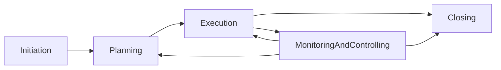

---

### Section 2: PMBOK 7th Edition Standards

PMBOK 7th Edition shifts from process-oriented groups to principle-based delivery and performance domains.

#### The 12 Principles of Project Delivery
These principles guide the behavior and actions of project professionals:
1. **Stewardship:** Be a diligent, respectful, and caring steward.
2. **Team:** Create a collaborative project team environment.
3. **Stakeholders:** Effectively engage with stakeholders.
4. **Value:** Focus on value and benefits realization.
5. **Systems Thinking:** Recognize, evaluate, and respond to system interactions.
6. **Leadership:** Demonstrate leadership behaviors.
7. **Tailoring:** Tailor the development approach based on context.
8. **Quality:** Build quality into processes and deliverables.
9. **Complexity:** Navigate complexity using knowledge and experience.
10. **Risk:** Optimize risk responses.
11. **Adaptability and Resiliency:** Embrace adaptability and resiliency.
12. **Change:** Enable change to achieve the envisioned future state.

#### The 8 Project Performance Domains
These domains represent groups of related activities critical for the effective delivery of project outcomes:
1. **Stakeholder Performance Domain:** Focuses on relationships and productive engagement.
2. **Team Performance Domain:** Focuses on leadership, collaboration, and team development.
3. **Development Approach and Lifecycle Performance Domain:** Focuses on development approach (Predictive, Agile, Hybrid) and lifecycle phases.
4. **Planning Performance Domain:** Focuses on organizing, estimating, and scheduling.
5. **Project Work Performance Domain:** Focuses on managing physical resources, processes, and procurement.
6. **Delivery Performance Domain:** Focuses on scope validation, deliverables, and quality.
7. **Measurement Performance Domain:** Focuses on tracking metrics (EVM) and taking corrective action.
8. **Uncertainty Performance Domain:** Focuses on risk management, reserves, and complexity.

---

### Section 3: Project Life Cycles

* **Predictive (Waterfall):** Plan-driven. Scope, schedule, and cost are determined in detail upfront. Scope changes are tightly controlled to protect the baselines. Best used when requirements are stable and well-understood.
* **Iterative:** Scope is determined early, but time and cost estimates are modified as the team's understanding of the product increases. The product is developed through repeated cycles to gradually refine the design based on feedback.
* **Incremental:** Deliverables are produced in functional parts (increments). Each increment adds new functionality, allowing the customer to receive value early.
* **Agile:** A combination of Iterative and Incremental approaches. It uses short, time-boxed cycles (sprints) with continuous customer feedback and highly flexible scope.
* **Hybrid:** A combination of Predictive and Agile approaches. Used when some project components are stable (e.g., hardware tooling or database cores) and some are highly uncertain (e.g., user interfaces).

---

### Section 4: Organizational Structures

* **Functional Organization:** Organized by specialty departments (e.g., IT, Finance, HR). The Project Manager has little to no authority, acting as a project coordinator or expediter. Functional managers control resources and budgets.
* **Matrix Organization:** A hybrid structure where authority is shared between the Project Manager and functional managers:
  * *Weak Matrix:* PM acts as a coordinator; functional manager retains power.
  * *Balanced Matrix:* Power is shared equally.
  * *Strong Matrix:* PM has high authority over resources and project decisions.
* **Projectized Organization:** Organized around projects. The Project Manager has absolute authority over budget and team members. Team members are dedicated to the project and have no functional department home.

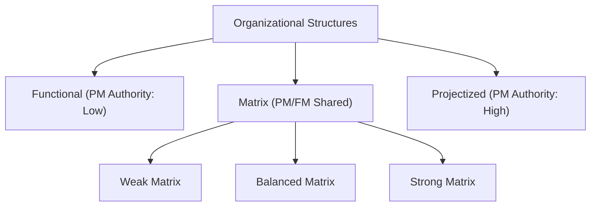

---

### Section 5: Integration & Change Control

#### Project Charter
A document issued by the project initiator or sponsor that formally authorizes the existence of a project and provides the project manager with the authority to apply organizational resources to project activities.
* **Key Contents:** Project purpose, high-level objectives, high-level scope, assigned PM and authority level, milestone summary schedule, budget summary, and sponsor's signature. (Note: WBS is not included in the charter).

#### Perform Integrated Change Control
The process of reviewing all change requests, evaluating their impact on project baselines, and deciding to approve, reject, or defer the changes.
* **The Step-by-Step Sequence:**
  1. Receive change request.
  2. Log the request immediately in the Change Log (first action).
  3. Analyze the impact on all constraints (Scope, Schedule, Cost, Quality, Risk, Resources).
  4. Discuss with the team and requester to evaluate alternatives.
  5. Present impact and options to the Change Control Board (CCB) for decision.
  6. If approved, update the Project Management Plan, baselines, and project documents.
  7. Communicate the decision and implement the change.

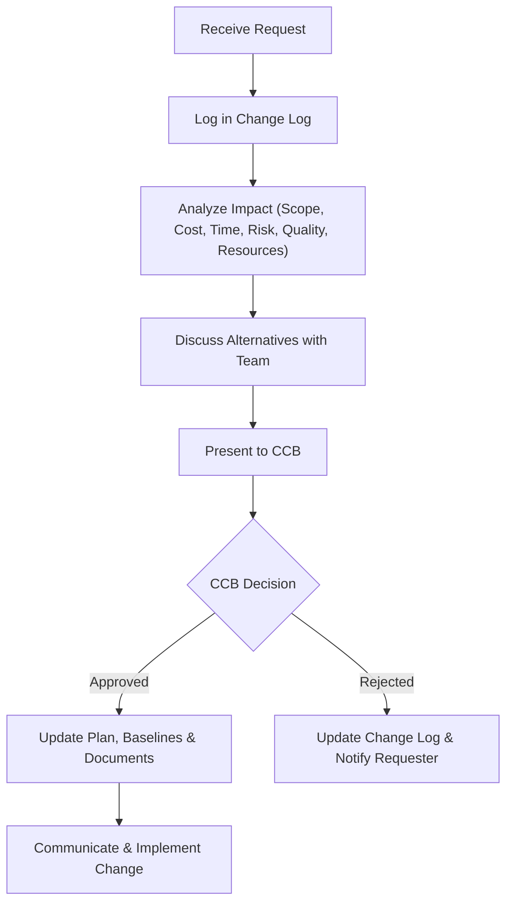
* **Change Control Board (CCB):** A formal group of stakeholders (led by the sponsor) responsible for reviewing, evaluating, approving, deferring, or rejecting changes to project baselines.

---

### Section 6: Scope Management

* **Project Scope:** The work required, and only the work required, to complete the project successfully.
* **Scope Baseline:** Comprised of the Project Scope Statement, the WBS, and the WBS Dictionary.
* **Work Breakdown Structure (WBS):** A deliverable-oriented hierarchical decomposition of the total scope of work to be performed by the project team. The lowest level of the WBS is the Work Package.

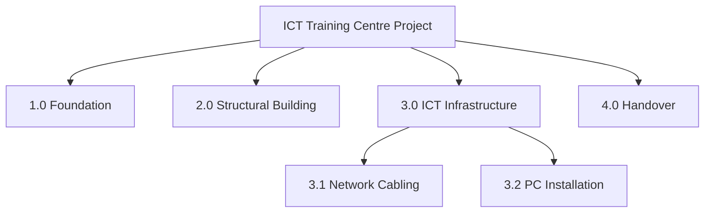
* **WBS Dictionary:** A document that provides detailed deliverable, activity, and scheduling information about each component in the WBS.
* **Scope Creep:** The uncontrolled, unauthorized expansion of scope without adjustments to time, cost, or resources. Caused by vague requirements, gold-plating, or weak change control.
* **Validate Scope vs. Quality Control:**
  * *Control Quality:* Focuses on technical correctness and meeting quality requirements (internal testing). Happens first.
  * *Validate Scope:* Focuses on formal acceptance of completed deliverables by the customer or sponsor (client sign-off). Happens second.

---

### Section 7: Schedule Management

* **Milestone:** A significant point or event in a project schedule (typically represented as an activity with zero duration).

#### Precedence Diagramming Method (PDM)
A technique used for constructing a schedule model in which activities are represented by nodes and are graphically linked by one or more logical relationships:
* **Dependency Relationships:**
  * Finish-to-Start (FS): Successor cannot start until predecessor finishes (most common).
  * Start-to-Start (SS): Successor cannot start until predecessor starts.
  * Finish-to-Finish (FF): Successor cannot finish until predecessor finishes.
  * Start-to-Finish (SF): Successor cannot finish until predecessor starts (rare).

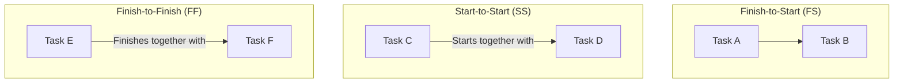
* **Leads and Lags:**
  * Lead: Acceleration of the successor activity (e.g., FS minus 2 days).
  * Lag: Directed delay of the successor activity (e.g., FS plus 3 days).

#### Resource Optimization Techniques
* **Resource Leveling:** Adjusts start and finish dates based on resource constraints. Often extends the critical path and delays the project.
* **Resource Smoothing:** Adjusts activities within their free and total float limits. Does not delay the project or change the critical path.

#### Scheduling Estimation Formulas (PERT)
* **Triangular Distribution:** $(O + M + P) / 3$
* **Beta (PERT) Distribution:** $(O + 4M + P) / 6$
* **Standard Deviation of an activity:** $(P - O) / 6$
* **Variance of an activity:** $[(P - O) / 6]^2$
*(Note: O = Optimistic, M = Most Likely, P = Pessimistic).*

#### Critical Path Method (CPM)
The sequence of dependent activities that represents the longest path through a project, determining the shortest possible project duration. Activities on the critical path have zero float.

#### Float (Slack)
The time an activity can be delayed without causing a project delay:
* **Total Float:** Delay allowed without delaying the overall project finish date.
* **Free Float:** Delay allowed without delaying the early start of the immediate successor activity.

---

### Section 8: Cost Management & Earned Value Management (EVM)

#### Cost Management Processes
1. **Plan Cost Management:** Deciding how costs will be estimated, budgeted, and controlled.
2. **Estimate Costs:** Predicting the financial resources required for each activity.
3. **Determine Budget:** Summing up the estimated costs of individual activities to establish an authorized Cost Baseline.
4. **Control Costs:** Monitoring spending and managing changes to prevent budget overruns.

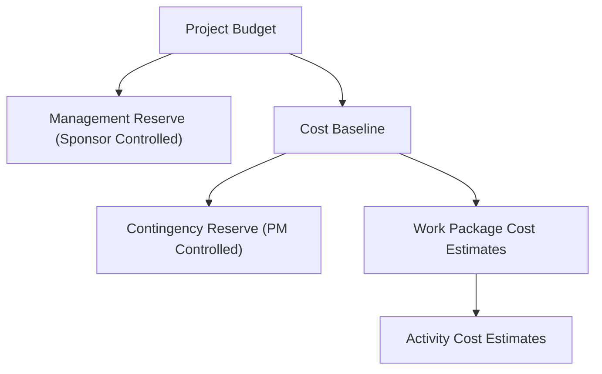

#### Funding Limit Reconciliation
The process of comparing the expenditure of project funds against any limits on the commitment of funds. It matches project spending needs to funding limits.

#### EVM Performance Metrics
* **Planned Value (PV):** Budgeted cost of scheduled work.
* **Earned Value (EV):** Budgeted value of work actually completed.
* **Actual Cost (AC):** Real money spent.
* **Cost Variance (CV):** $EV - AC$ (Negative = Over budget; Positive = Under budget).
* **Schedule Variance (SV):** $EV - PV$ (Negative = Behind schedule; Positive = Ahead of schedule).
* **Cost Performance Index (CPI):** $EV / AC$ ($<1.0$ = Over budget; $>1.0$ = Under budget).
* **Schedule Performance Index (SPI):** $EV / PV$ ($<1.0$ = Behind schedule; $>1.0$ = Ahead of schedule).
* **Budget at Completion (BAC):** The total approved budget for the project.
* **Estimate at Completion (EAC):** Expected total cost at completion ($EAC = BAC / CPI$ under current efficiency).
* **Estimate to Complete (ETC):** Expected cost to finish remaining work ($ETC = EAC - AC$).
* **Variance at Completion (VAC):** Expected variance at completion ($VAC = BAC - EAC$).

---

### Section 9: Quality Management

* **Quality vs. Grade:**
  * *Quality:* Meeting requirements (low quality is always bad).
  * *Grade:* Category or level of features (low grade is acceptable as long as it works as intended).
* **Prevention vs. Inspection:** Prevention (QA) keeps errors out of the process; inspection (QC) keeps errors out of the hands of the customer.
* **Quality Assurance (QA / Manage Quality):** Process-oriented. Audits procedures and tools to prevent defects.
* **Quality Control (QC):** Product-oriented. Inspects and tests physical deliverables to identify and correct defects.

#### The Seven Basic Quality Tools

These tools are used to solve quality-related issues during project execution and control:

##### 1. Cause-and-Effect Diagram (Ishikawa / Fishbone Diagram)
Identifies potential root causes of a quality problem by breaking them down into categories (People, Machine, Material, Method).

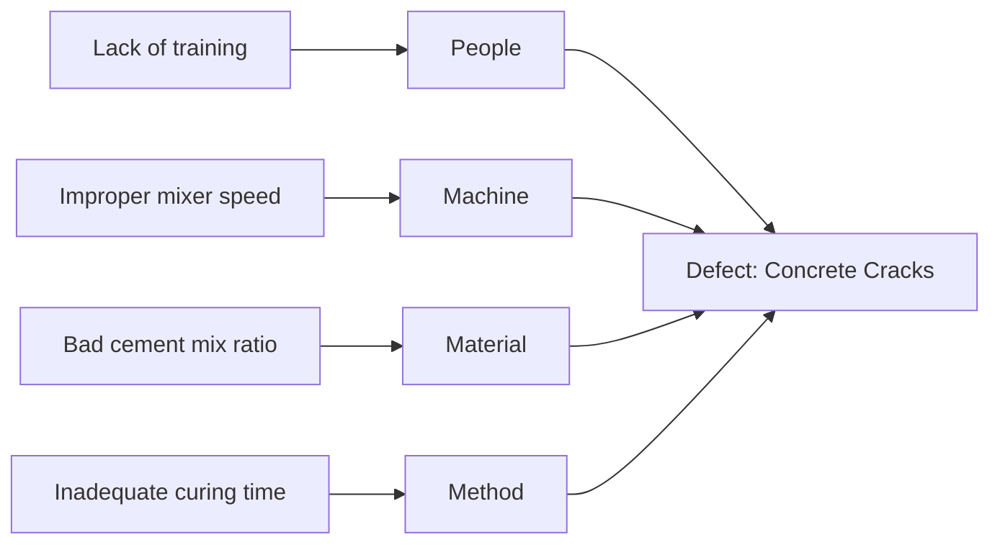

##### 2. Flowcharts
Graphically display the sequential steps in a process, including decision loops.

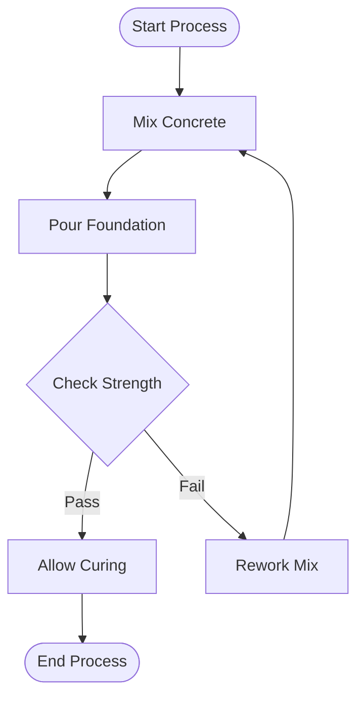

##### 3. Check Sheets (Tally Sheets)
Used as a structured form to collect and log defect data in real time.

| Defect Type | Mon | Tue | Wed | Thu | Fri | Total |
| :--- | :--- | :--- | :--- | :--- | :--- | :--- |
| Surface Cracks | \|\|\| | \|\| | \|\|\|\| | \| | \|\| | 12 |
| Size Deviation | \| | \| | | \| | \| | 4 |
| Discoloration | \|\| | | \| | | \| | 4 |

##### 4. Pareto Diagram
A bar chart ordered by frequency of occurrence, displaying the cumulative percentage to isolate the 80/20 rule (80% of problems come from 20% of causes).

| Cause of Defect | Frequency | Cumulative % | Visual Pareto Distribution |
| :--- | :--- | :--- | :--- |
| **1. Inadequate Curing** | 50 | 50% | `[====================]` (80% boundary) |
| **2. Bad Mix Ratio** | 30 | 80% | `[============]` |
| **3. Machine Faults** | 10 | 90% | `[====]` |
| **4. Human Fatigue** | 10 | 100% | `[====]` |

##### 5. Histogram
A bar chart displaying frequency distributions of numerical data to show the shape and center of a process.

```text
Frequency Distribution of Concrete Strength Measurements (MPa):
20-22 MPa | ** (2)
23-25 MPa | ****** (6)
26-28 MPa | ********** (10)  <-- Process Mean
29-31 MPa | ******* (7)
32-34 MPa | * (1)
```

##### 6. Control Chart
Used to track process stability over time. It displays upper and lower control limits (calculated at +/- 3 standard deviations) and tracks whether the process is out of control (using the Rule of Seven).

```text
UCL (35 MPa) ------------------------------------------------------------ (Upper Control Limit)
                  \        /        \
Mean (30 MPa) -----\------/----------\------/----------\----------/------- (Process Mean)
                             \        /            \        /
LCL (25 MPa) -----------------\----------------------\-------------------- (Lower Control Limit)
```

##### 7. Scatter Diagram
A Cartesian coordinate graph showing the relationship and correlation between two variables (independent and dependent).

```text
Strength (MPa)
  ^
40|               * (High Water-to-Cement Ratio yields lower strength)
35|           *   *
30|         *   *
25|       *   *
  +------------------------> Cement Density (kg/m3)
  (Positive Correlation: Higher density correlates with higher strength)
```

---

### Section 10: Resource & Conflict Management

#### Team Development Stages (Tuckman Ladder)
* **Forming:** Orientation; team meets, polite, roles unclear.
* **Storming:** Conflict; clash of personalities, disagreement on methods.
* **Norming:** Cohesion; trust builds, conflicts resolve, processes align.
* **Performing:** Synergy; high functioning, autonomous work.
* **Adjourning:** Separation; project ends, team releases.

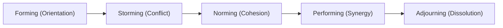

#### Human Motivation Theories
* **Maslow's Hierarchy of Needs:** Needs progress from physiological, safety, social, and esteem, to self-actualization.
* **Herzberg's Motivation-Hygiene Theory:** Hygiene factors (salary, conditions) prevent dissatisfaction but do not motivate; motivators (recognition, growth) drive performance.
* **McGregor's Theory X and Theory Y:** Theory X assumes employees dislike work and need supervision; Theory Y assumes employees are self-motivated and seek responsibility.
* **McClelland's Theory of Needs:** Employees are motivated by the need for achievement, power, or affiliation.

#### Conflict Resolution Techniques
1. **Collaborating / Problem Solving:** Win-win. PM guides parties to address the root cause and reach a consensus (most effective).
2. **Compromising / Reconciling:** Lose-lose. Both sides give up something to reach a temporary, middle-ground agreement.
3. **Forcing / Directing:** Win-lose. PM uses authority to push one viewpoint at the expense of another (used in emergencies).
4. **Smoothing / Accommodating:** Lose-win. PM highlights areas of agreement and downplays differences to keep the peace.
5. **Avoiding / Withdrawing:** PM withdraws or delays resolution (used when issues are trivial).

#### Control Resources
Managing and tracking physical resources (materials, equipment, facilities) to ensure they are used efficiently and not wasted.

---

### Section 11: Communication Management

* **Interactive Communication:** Real-time, two-way exchange (meetings, calls). Most effective.
* **Push Communication:** Sent directly to audience (emails, reports). No guarantee of understanding.
* **Pull Communication:** Stored centrally, accessed by audience at discretion (intranet, database portals). Best for large groups or data.
* **Communication Channels Formula:** $\frac{n(n-1)}{2}$ where $n$ is the total number of stakeholders.

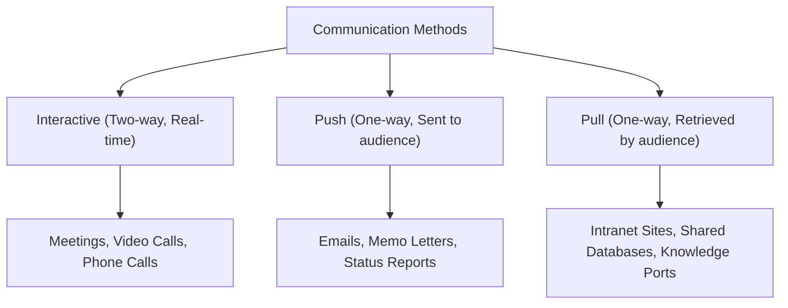

---

### Section 12: Risk Management

* **Risk vs. Issue:** A **Risk** is a future uncertainty; an **Issue** is a current reality that has already occurred.
* **Threat Responses (Negative Risks):**
  * *Avoid:* Eliminate the threat entirely (e.g., change the plan).
  * *Mitigate:* Reduce probability or impact.
  * *Transfer:* Shift ownership to a third party (e.g., buy insurance).
  * *Accept:* Take no active action (Active = Contingency Reserve; Passive = Workarounds).
* **Opportunity Responses (Positive Risks):**
  * *Exploit:* Ensure it happens.
  * *Enhance:* Increase probability or impact.
  * *Share:* Partner with a third party.
  * *Accept:* Take no active measures.
* **Reserves:**
  * *Contingency Reserve:* For known-unknowns (risks in the risk register). Managed by the PM. Part of the cost baseline.
  * *Management Reserve:* For unknown-unknowns (unidentified risks). Managed by the Sponsor. Requires approval to access. Not part of the cost baseline.
* **Expected Monetary Value (EMV):** $\text{EMV} = \text{Probability} \times \text{Impact}$.

#### Risk Tools & Analysis
* **Risk Breakdown Structure (RBS):** Hierarchical structure of potential risk sources.

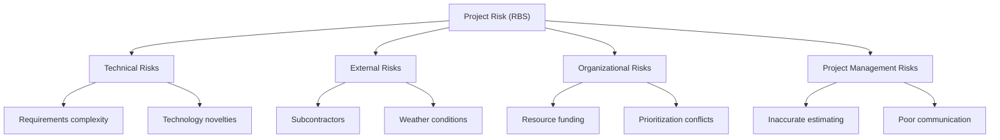

* **Tornado Diagram:** Chart used in sensitivity analysis to show which risks have the largest potential impact. It plots variables vertically and the range of cost or schedule impact horizontally, sorted from widest impact at the top to narrowest at the bottom (forming a tornado shape).

  **Sample Tornado Diagram (Sensitivity Analysis Layout):**
  
  | Variable Impacting Cost | Negative Impact | Baseline | Positive Impact | Visual Impact Range |
  | :--- | :--- | :--- | :--- | :--- |
  | **Permit Approval Delay** | -$40k | $0$ | +$30k | `[=========[0]======]` |
  | **Subcontractor Shortage** | -$25k | $0$ | +$20k | `  [======[0]====]  ` |
  | **Material Price Shift** | -$15k | $0$ | +$15k | `   [====[0]====]   ` |
  | **Weather Delays** | -$5k | $0$ | +$5k | `     [==[0]==]     ` |

* **Monte Carlo Simulation:** Computer model that runs thousands of iterations using random values from probability distributions (like triangular or beta) to calculate the probability of completing the project on time and within budget.

  **Sample Monte Carlo Output (S-Curve & Probability Distribution):**
  
  * **Cumulative Probability S-Curve:**
  ```text
  100% |                                      .--- [90% Target: $150k]
       |                                _..-''
   50% |                          _..-'' [50% Target: $120k]
       |                    _..-''
    0% |______________..-''____________________
       $95k         $120k        $150k        Project Cost
  ```

---

### Section 13: Procurement Management

* **Fixed-Price (FP / FFP) Contract:** Price is set. Seller bears all cost risk. Best for clear, finalized scopes.
* **Cost-Reimbursable (CR) Contract:** Buyer pays all vendor actual costs plus a fee/profit. Buyer bears all cost risk. Best for complex, undefined scopes.
* **Time & Materials (T&M) Contract:** Hybrid contract. Paid per hour/unit. Best for short-term labor or resource augmentation.

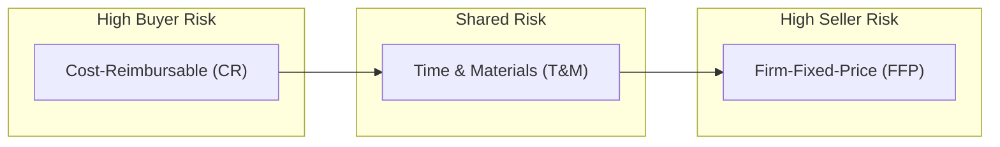

#### Procurement Documents
* **Request for Information (RFI):** Used to gather general market information about vendor capabilities.

  **Sample RFI Layout (Information Gathering Only):**
  
  | Section | Field | Description / Vendor Input |
  | :--- | :--- | :--- |
  | **RFI Header** | Project Reference | *Upcoming ICT Infrastructure Upgrade* |
  | | Date / Deadline | *June 2026 / Responses due by July 15, 2026* |
  | **Vendor Info** | Company Profile | *Provide company history, size, and geographic coverage.* |
  | | Core Capabilities | *Summarize technical qualifications in server deployment.* |
  | **Market Input**| Past Projects | *List 3 similar projects completed in the last 2 years.* |
  | | Technology Suggestions | *Recommend server specs and licensing models (no pricing).* |

* **Request for Quotation (RFQ):** Used for purchasing standard, commodity-like items where price is the main factor.

  **Sample RFQ Layout (Price Quote Log):**
  
  | Item ID | Description | Technical Specifications | Quantity | Target Delivery | Vendor Unit Price (USD) | Vendor Total Price (USD) |
  | :--- | :--- | :--- | :--- | :--- | :--- | :--- |
  | **IT-EQ-01**| Office Monitor | 24-inch IPS, 1080p, HDMI | 100 units | August 1, 2026 | *[To be filled by Vendor]* | *[To be filled by Vendor]* |
  | **IT-EQ-02**| USB-C Hub | 8-in-1, HDMI, SD Card Reader | 100 units | August 1, 2026 | *[To be filled by Vendor]* | *[To be filled by Vendor]* |

* **Request for Proposal (RFP):** Used for complex solutions where the technical approach is valued alongside cost.

  **Sample RFP Evaluation Framework (Weighted Scoring Layout):**
  
  | Evaluation Criteria | Description | Weight (%) | Vendor Score (1-10) | Weighted Score |
  | :--- | :--- | :--- | :--- | :--- |
  | **Technical Solution** | Architecture, design feasibility, security | 40% | *[Assessed by Team]* | *[Weight x Score]* |
  | **Vendor Qualifications** | Case studies, team experience, SLA terms | 30% | *[Assessed by Team]* | *[Weight x Score]* |
  | **Cost Proposal** | Total cost, licensing fees, support costs | 30% | *[Assessed by Team]* | *[Weight x Score]* |
  | **Total Evaluation** | **Overall Fit** | **100%** | | **[Sum of Scores]** |

#### Point of Total Assumption (PTA) Formula
Used in incentive fee contracts to determine the point where the seller assumes all cost risk:
$$\text{PTA} = \frac{\text{Target Price} - \text{Target Cost}}{\text{Buyer Share Ratio}} + \text{Target Cost}$$

---

### Section 14: Stakeholder Management

* **Stakeholder:** Anyone who can affect, be affected by, or perceive themselves to be affected by the project.
* **Power/Interest Grid:**
  * *High Power, High Interest:* Manage Closely.
  * *High Power, Low Interest:* Keep Satisfied.
  * *Low Power, High Interest:* Keep Informed.
  * *Low Power, Low Interest:* Monitor.

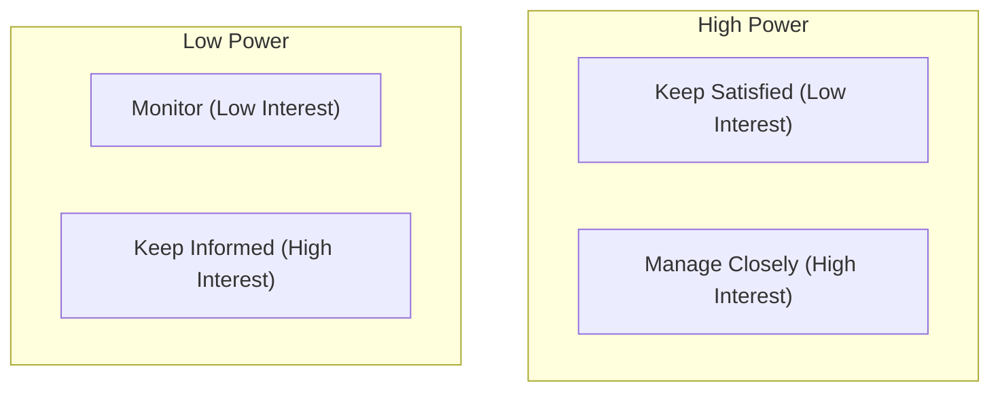

---

### Section 15: Agile & Scrum

* **Agile Project Management:** An iterative, incremental approach to project management that focuses on flexibility, short development cycles (sprints), customer feedback, and team self-organization.
* **Scrum Roles:**
  * **Product Owner (PO):** Represents the business and customer. Manages the Product Backlog, prioritizing requirements to maximize product value.
  * **Scrum Master:** Servant leader who facilitates meetings, guides the team on Agile practices, and removes blockers/impediments.
  * **Development Team:** A self-organizing, cross-functional group that does the actual work to build the sprint deliverable.

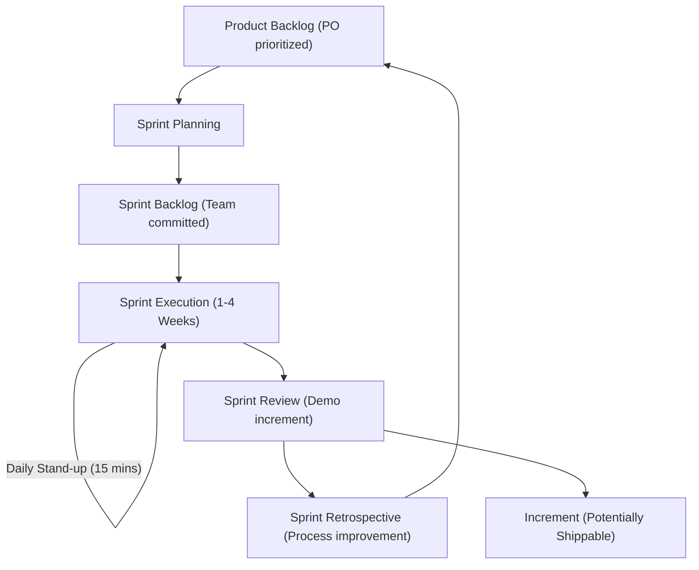

---

### Section 16: Project Termination Methods

* **Termination by Extinction:** Project completed or canceled, work stops completely, team disbanded (nothing continues).
* **Termination by Addition:** Deliverable becomes a new permanent department/unit of the company.
* **Termination by Integration:** Deliverables are absorbed directly into existing company operations.
* **Termination by Starvation:** Project slowly dies due to gradual budget or resource cuts.

---

### Section 17: PMI Code of Ethics

* **Responsibility:** Take ownership of decisions and errors. Refuse assignments you are not qualified to perform.
* **Respect:** Listen to others and value diversity.
* **Fairness:** Disclose conflicts of interest immediately. Remain objective (no favoritism or bribery).
* **Honesty:** Always report the truth. Do not omit bad news or mislead stakeholders.

---

### Section 18: System for Value Delivery

The System for Value Delivery is a collection of strategic business activities aimed at building, sustaining, and advancing an organization. Projects, programs, portfolios, operations, and product management are components that produce outcomes to realize benefits and deliver value.

#### Functions Associated with Projects
PMBOK 7 focuses on key functions that must be performed by the project team:
* **Provide Oversight and Coordination:** Ensuring the project aligns with organizational goals and tracking deliverables.
* **Present Objectives and Feedback:** Guiding the team and defining requirements.
* **Facilitate and Support:** Helping the team remove obstacles and resolve problems.
* **Perform Work and Contribute Insights:** Producing physical deliverables and providing technical expertise.
* **Apply Expertise:** Utilizing specialized knowledge (e.g., engineering, legal, finance).
* **Provide Business Direction and Insight:** Ensuring the project remains viable and delivers business value.
* **Provide Resources and Direction:** Securing the funding, staff, and materials.
* **Foster Governance:** Maintaining project compliance with corporate policies and standards.

#### Product Management
The discipline of managing the complete lifecycle of a product (conception, growth, maturity, and decline). Product lifecycles can span multiple projects (e.g., Project A builds the software, Project B upgrades the interface, Project C retires the system).

---

### Section 19: The Tailoring Process

Tailoring is the deliberate adaptation of the project management approach, governance, and processes to make them fit the specific environment and the work.

#### The 4 Steps of the Tailoring Process
1. **Select Initial Development Approach:** Choose the core framework (Predictive, Agile, or Hybrid) that fits the project's uncertainty and scope requirements.
2. **Tailor for the Organization:** Adapt the approach to align with the organization's PMO guidelines, policies, and standard templates.
3. **Tailor for the Project:** Adjust the selected approach based on project size, complexity, criticality, and stakeholder needs.
4. **Implement Continuous Improvement:** Regularly monitor how the tailored processes are working (e.g., during sprint retrospectives or phase reviews) and make adjustments as needed.

---

### Section 20: Models, Methods, and Artifacts

PMBOK 7 classifies project management tools into three distinct categories: Models, Methods, and Artifacts.

---

#### 1. Models
High-level thinking frameworks or leadership theories used to explain scenarios or guide project team behavior.

##### Hersey-Blanchard Situational Leadership Model
Maps leadership styles based on the readiness and maturity of the project team members:

| Style | Name | Behavior Profile | Team Readiness Level |
| :--- | :--- | :--- | :--- |
| **S1** | Directing | High directive, low supportive (leader defines roles and closely supervises). | Low competence, low commitment (unable and unwilling/insecure). |
| **S2** | Coaching | High directive, high supportive (leader explains decisions and solicits suggestions). | Some competence, high commitment (unable but willing/motivated). |
| **S3** | Supporting | Low directive, high supportive (leader shares ideas and facilitates decision making). | High competence, variable commitment (able but unwilling/insecure). |
| **S4** | Delegating | Low directive, low supportive (leader turns over responsibility for decisions). | High competence, high commitment (able and willing/confident). |

##### Shannon-Weaver Communication Model
The classic linear model illustrating the transmission of information and the impact of noise/barriers:

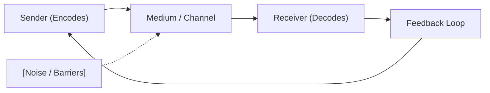

##### Kotter's 8-Step Change Model
A sequential framework for managing organizational or project change:

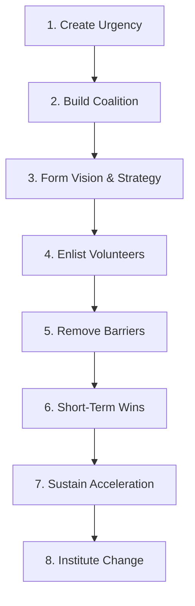

##### Prosci's ADKAR Change Model
Focuses on individual change progression:

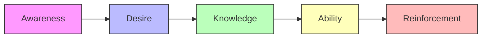

---

#### 2. Methods
Structured activities, estimating systems, and analysis operations used to produce specific deliverables or decisions.

##### Estimating Methods Comparison Matrix
Used during planning to calculate project schedules and budgets:

| Method | Speed | Accuracy | Cost | PMBOK Description & Usage |
| :--- | :--- | :--- | :--- | :--- |
| **Analogous** | High | Low | Low | Uses historical data from a similar past project. Used in early phases. |
| **Parametric** | Medium | Medium | Medium | Uses mathematical algorithms based on historical relationships (e.g. cost per square meter). |
| **Bottom-Up** | Low | High | High | Decomposes WBS packages to estimate individual details, then sums them up. Most accurate. |
| **PERT** | Medium | High | Medium | Three-point weighted average taking into account Optimistic, Most Likely, and Pessimistic values. |

##### Root-Cause Analysis (The 5 Whys Technique)
A structured diagnostic method used to trace a visible defect back to its original management or process failure:

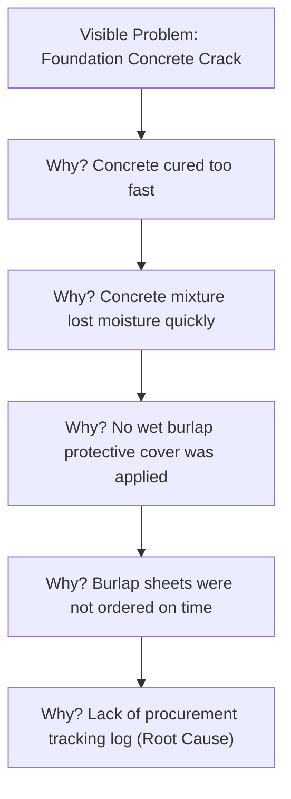

---

#### 3. Artifacts
The physical documents, logs, and baselines used to record information and maintain configuration control:

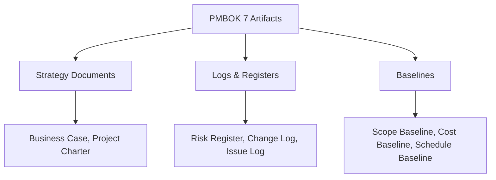

*(Note: Detailed templates and layout examples for these Strategy, Log, and Baseline artifacts are fully illustrated in Section 21).*


---

### Section 21: Project Management Document Templates & Layouts

This section provides visual structures and layouts for the standard documents used by a Project Manager to initiate, plan, control, and close projects.

#### 1. Project Charter Template Layout
Used during initiation to formally authorize the project.

| Section | Field | Description |
| :--- | :--- | :--- |
| **Header** | Project Title | Official project name. |
| | Sponsor / Initiator | Name and title of funding authority. |
| | Project Manager | Name of assigned PM and their authority level. |
| **Context** | Business Case | Strategic reasons and financial justification for the project. |
| | Project Purpose | Measurable goals and strategic alignment. |
| **Scope & Time**| High-Level Scope | Key deliverables, in-scope work, and major exclusions. |
| | Milestone Schedule | Target completion dates for significant phases or events. |
| **Finance** | Summary Budget | High-level cost estimates and funding sources. |
| **Governance** | Key Assumptions | High-level assumptions accepted as true without proof. |
| | Key Constraints | Time, budget, or resource limitations. |
| | Approval | Signatures of Sponsor and Project Manager authorizing work. |

#### 2. Stakeholder Register Layout
Used to identify and plan engagement strategies.

| Stakeholder ID | Name | Role / Department | Power (H/M/L) | Interest (H/M/L) | Engagement Classification | Primary Communication Channel |
| :--- | :--- | :--- | :--- | :--- | :--- | :--- |
| STK-001 | Dr. Akin | Sponsor | High | High | Manage Closely | Weekly face-to-face meetings |
| STK-002 | Sarah | Lead Architect | Low | High | Keep Informed | Daily Scrum, email updates |
| STK-003 | Chief Inspector | Government Regulator | High | Low | Keep Satisfied | Monthly compliance reports |
| STK-004 | Community Rep | Local Advisor | Low | Low | Monitor | Public bulletin, monthly newsletters |

#### 3. Risk Register Layout
Used to log, analyze, and manage project threats and opportunities.

| Risk ID | Description | Category | Probability (1 to 5) | Impact (1 to 5) | Risk Score (P x I) | Response Strategy | Mitigation / Action Plan | Owner | Status |
| :--- | :--- | :--- | :--- | :--- | :--- | :--- | :--- | :--- | :--- |
| RSK-01 | Hardware delivery delay | External | 3 | 4 | 12 | Mitigate | Pre-order from local backup vendor | John (IT) | Open |
| RSK-02 | Key developer leaves | Technical | 2 | 5 | 10 | Mitigate | Cross-train team on codebase | Sarah | Open |
| RSK-03 | Subcontractor rate increase | Commercial | 2 | 3 | 6 | Transfer | Draft fixed-price SLA contracts | PM | Closed |

#### 4. Change Log Layout
Used to track the status of all change requests.

| Change ID | Date Logged | Description | Requester | Impact Analysis Summary | CCB Status | Date Decided | Implementation Owner |
| :--- | :--- | :--- | :--- | :--- | :--- | :--- | :--- |
| CR-001 | 2026-06-10 | Add backup generator | Sponsor | Scope increase, Cost: $+5000 USD$, Schedule: no change | Approved | 2026-06-12 | Construction Lead |
| CR-002 | 2026-06-15 | Change UI color scheme | User Group | Scope modification, Cost: none, Schedule: $+2 days$ | Rejected | 2026-06-17 | N/A |
| CR-003 | 2026-06-20 | Upgrade database servers | Lead Tech | Scope increase, Cost: $+8000 USD$, Schedule: $+5 days$ | Deferred | Pending | DB Admin |

#### 5. Issue Log Layout
Used to track current problems that have already occurred.

| Issue ID | Description | Severity (H/M/L) | Date Logged | Owner | Action Plan | Target Date | Current Status |
| :--- | :--- | :--- | :--- | :--- | :--- | :--- | :--- |
| ISS-01 | Foundation concrete cracked | High | 2026-06-22 | Build Lead | Apply epoxy injection seal, schedule reinspection | 2026-06-28 | In Progress |
| ISS-02 | Test server power outage | Medium | 2026-06-24 | IT Support | Relocate database services to cloud backup | 2026-06-25 | Closed |

#### 6. Communication Management Plan Template
Used to organize stakeholder communications.

| Stakeholder Group | Information Needs | Frequency | Format / Channel | Sender | Approval Required? |
| :--- | :--- | :--- | :--- | :--- | :--- |
| Project Sponsor | Budget variances, milestones status | Monthly | PDF Executive Summary report | Project Manager | Yes, PM approval |
| Development Team | Daily tasks, blockages, sprint goals | Daily | 15-minute Stand-up Meeting | Scrum Master | No |
| End Users | Feature training, release notes | Bi-weekly | Intranet Portal post (Pull) | Technical Writer | Yes, PO approval |

---

### Section 22: High-Yield PMI PMP Mock Examination

This section contains 10 realistic, situational multiple-choice questions aligned with the latest PMI PMP exam guidelines.

#### Question 1
A project manager is leading a software project using a hybrid approach. During execution, the product owner continuously requests changes to the user interface because of changing customer preferences. The development team is struggling to maintain their sprint velocity. What should the project manager do first?
* A. File a formal change request to the Change Control Board (CCB) to extend the timeline.
* B. Advise the product owner to wait until the end of the project to request any changes.
* C. Facilitate a meeting between the product owner and development team to prioritize the backlog and determine how many user stories can be completed within the sprint capacity.
* D. Tell the team to work overtime to accommodate all the product owner's requests.
* **Correct Answer: C**
* *Justification:* In a hybrid project, the software components are managed using Agile. Backlog prioritization and sprint planning are dynamic processes managed by the Product Owner and Team. Directing the team to work overtime (D) is unethical and unsustainable. Raising a CCB change request (A) is premature for sprint-level backlog adjustments.

#### Question 2
The project manager is reviewing the risk register and notes that a key hardware component has a high probability of delivery failure. The project schedule cannot be delayed, and the budget is tight. The project manager decides to sign a fixed-price agreement with a supplier who guarantees delivery, transferring the financial penalty of any delays to the supplier. Which risk response strategy is this?
* A. Avoid
* B. Mitigate
* C. Transfer
* D. Accept
* **Correct Answer: C**
* *Justification:* Transferring involves shifting the financial consequences and ownership of a threat to a third party (in this case, using a fixed-price contract with delay penalties). Mitigation (B) reduces probability or impact; Avoidance (A) eliminates the threat entirely.

#### Question 3
During a monthly project review, the project manager calculates these metrics:
* Planned Value (PV) = $120,000 USD$
* Earned Value (EV) = $100,000 USD$
* Actual Cost (AC) = $110,000 USD$
What is the correct interpretation of the project's performance?
* A. The project is under budget and ahead of schedule.
* B. The project is over budget and behind schedule.
* C. The project is under budget and behind schedule.
* D. The project is over budget and ahead of schedule.
* **Correct Answer: B**
* *Justification:*
  * Cost Variance ($CV = EV - AC = 100,000 - 110,000 = -10,000$). Negative CV means over budget.
  * Schedule Variance ($SV = EV - PV = 100,000 - 120,000 = -20,000$). Negative SV means behind schedule.

#### Question 4
A project manager has been assigned to a large infrastructure project. During stakeholder analysis, she identifies a local environmental group that has low authority to affect the project decisions but is highly interested in the project's ecological impact. According to the Power/Interest Grid, how should the project manager manage this group?
* A. Manage closely
* B. Keep satisfied
* C. Keep informed
* D. Monitor
* **Correct Answer: C**
* *Justification:* Stakeholders with low power but high interest fall into the "Keep Informed" quadrant. The project manager should provide regular, proactive updates to address their ecological concerns and build goodwill.

#### Question 5
A team member verbally requests a minor change to the layout of a database system to make data entry easier. The change will not impact the project cost or schedule. What should the project manager do first?
* A. Implement the change immediately to keep the team member motivated.
* B. Instruct the team member to submit a formal change request to be logged in the Change Log.
* C. Reject the change request because it did not go through the Change Control Board.
* D. Discuss the change in the next weekly meeting with the sponsor.
* **Correct Answer: B**
* *Justification:* Every change request, no matter how small or low-impact, must be officially logged in the Change Log before any analysis or implementation begins. This ensures configuration control.

#### Question 6
A Scrum team is in the middle of a two-week sprint when the CEO requests a new feature be added immediately to the current sprint. What is the correct action for the Scrum Master?
* A. Add the feature to the current sprint and adjust the team's working hours.
* B. Instruct the CEO to talk to the Product Owner to place and prioritize the feature in the Product Backlog for future sprints.
* C. Direct the development team to stop their current work and implement the CEO's request.
* D. Tell the CEO that changes are never allowed in Agile once a project starts.
* **Correct Answer: B**
* *Justification:* In Scrum, the Product Owner is the sole authority for managing and prioritizing the Product Backlog. No one, including executive leadership, should add work directly to the team during a sprint. The request must go to the Product Owner for prioritization in a future sprint.

#### Question 7
A company is outsourcing the development of a proprietary billing software system. The requirements are complex and highly likely to change as the system integrates with legacy software. The buyer wants to minimize financial risk while ensuring the vendor delivers quality work. Which contract type is most appropriate?
* A. Firm-Fixed-Price (FFP)
* B. Time and Materials (T&M)
* C. Cost-Reimbursable (CR)
* D. Fixed Price Incentive Fee (FPIF)
* **Correct Answer: C**
* *Justification:* When requirements are complex and likely to change, a Cost-Reimbursable contract is appropriate because it prevents the vendor from bidding too high to cover risk or walking away if the scope changes. It allows flexibility to adjust requirements. (FPIF or FFP would force the seller to bear too much risk, potentially causing low-quality output or vendor default).

#### Question 8
A project manager has successfully delivered the unique project deliverables, and the client is happy. However, the client is delaying signing the formal project closure documents. What should the project manager do first?
* A. Close the project unilaterally and release the project team.
* B. Meet with the client to determine the root cause of the delay in signing.
* C. File a formal complaint with the project sponsor.
* D. Suspend the client's access to the delivered system.
* **Correct Answer: B**
* *Justification:* When facing delays or resistance from stakeholders, the project manager must first seek to understand the root cause (Collaborating/Problem Solving). A unilateral closure (A) is unprofessional, and retaliation (D) violates business practice and PMI ethics.

#### Question 9
A project manager is analyzing a network diagram. Activity A takes 4 days, Activity B takes 6 days, and Activity C takes 3 days. Activity A is a predecessor of Activity B and Activity C. The project schedule has a fixed deadline. The resource assigned to both Activity B and Activity C is the same database administrator, who cannot work on both tasks simultaneously. Which technique should the project manager use to adjust the schedule without extending the project end date?
* A. Resource Leveling
* B. Fast-Tracking
* C. Resource Smoothing
* D. Crashing
* **Correct Answer: C**
* *Justification:* Resource Smoothing adjusts activities within their float limits, optimizing resource assignments without extending the project deadline. Resource Leveling (A) can delay the project finish date.

#### Question 10
During a project audit, the project manager discovers that a vendor sent a high-value smartphone as a holiday gift to a technical lead on the project team. The lead did not report the gift. What should the project manager do first?
* A. Report the vendor to the legal department and terminate the contract.
* B. Instruct the technical lead to return the gift immediately and review the conflict of interest policy.
* C. Confiscate the phone and use it as a team testing device.
* D. Ignore the gift since the holiday season is a traditional time for gifts.
* **Correct Answer: B**
* *Justification:* Under the PMI Code of Ethics and Professional Conduct (Fairness and Honesty), project professionals must refuse and report any gifts that could represent a conflict of interest or appear to influence decisions. The PM must instruct the lead to return it and reinforce compliance policies.

---
---
